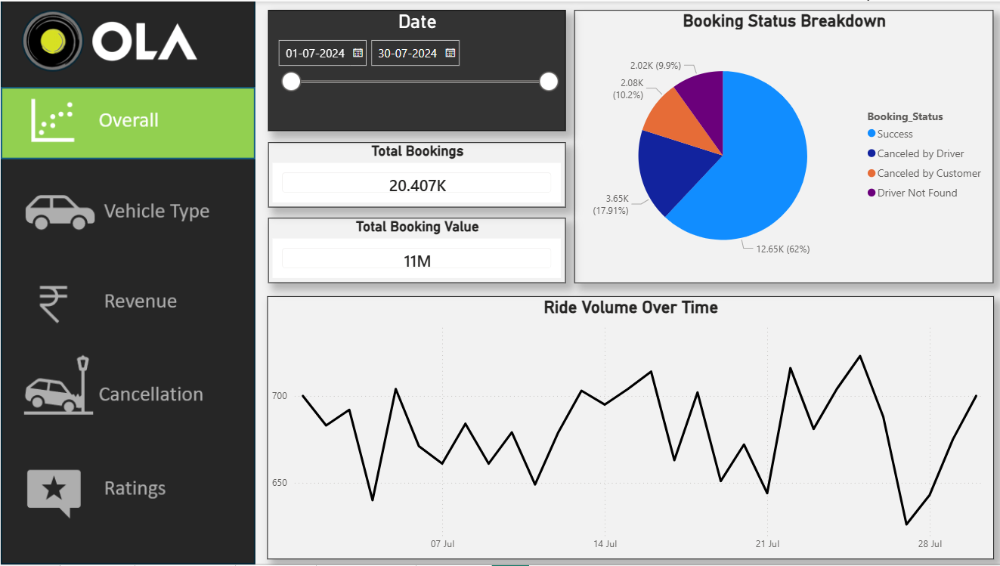
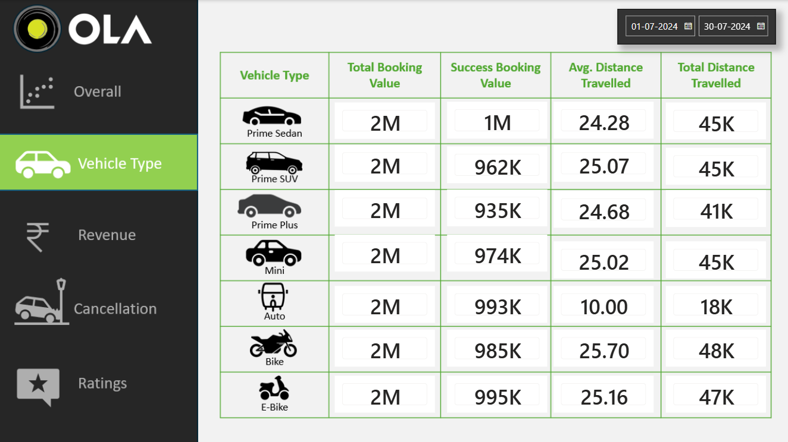
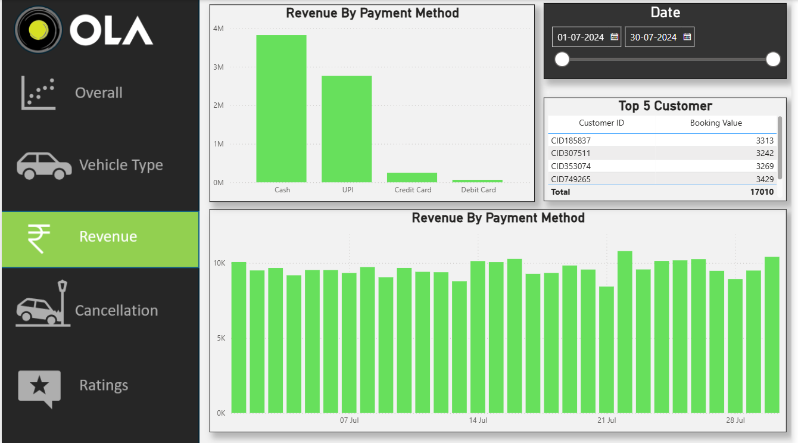
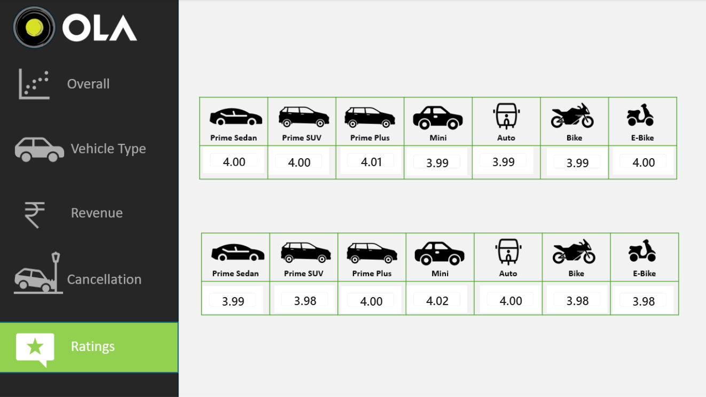

# 🚖 SQL + Power BI Project — OLA Data Analysis

A complete end-to-end OLA rides analytics project using a **20,000-row dataset**.  
This project combines SQL exploration, KPI extraction, and a multi-page Power BI dashboard designed to understand booking patterns, cancellations, ratings, and revenue.

---

## 📁 Project Structure

01_SQL/ → SQL queries & results
02_Dashboard/ → Power BI (.pbix) file
03_Images/ → Dashboard screenshots (1.png–5.png)
04_Dataset/ → Raw dataset
README.md → Project overview

---

## 🗂 Dataset Columns

1. Date  
2. Time  
3. Booking_ID  
4. Booking_Status  
5. Customer_ID  
6. Vehicle_Type  
7. Pickup_Location  
8. Drop_Location  
9. V_TAT  
10. C_TAT  
11. Cancelled_Rides_by_Customer  
12. Cancelled_Rides_by_Driver  
13. Incomplete_Rides  
14. Incomplete_Rides_Reason  
15. Booking_Value  
16. Payment_Method  
17. Ride_Distance  
18. Driver_Ratings  
19. Customer_Rating  

---

# 🧩 SQL Analysis (Completed)

All SQL questions solved in this project:

1. Retrieve all successful bookings  
2. Average ride distance by vehicle type  
3. Total rides cancelled by customers  
4. Top 5 customers with the highest number of bookings  
5. Driver cancellations (personal + car-related issues)  
6. Max & min driver ratings for Prime Sedan  
7. Rides paid via UPI  
8. Average customer rating per vehicle type  
9. Total booking value of successful rides  
10. All incomplete rides with reasons  

👉 **SQL files included in:** `01_SQL/`

---

# 📊 Power BI Dashboard (Screenshots Included)

---

## 📌 Power BI Insights

1. **Ride Volume Over Time**  
2. **Booking Status Breakdown (Completed, Cancelled, Incomplete)**  
3. **Top 5 Vehicle Types by Ride Distance**  
4. **Average Customer Rating by Vehicle Type**  
5. **Cancellation Reasons — Customer vs Driver**  
6. **Revenue by Payment Method**  
7. **Top 5 Customers by Booking Value**  
8. **Ride Distance Distribution Per Day**  
9. **Driver Ratings Distribution**  
10. **Customer vs Driver Ratings Analysis**

👉 **PBIX file included in:** `02_Dashboard/`

---

# 🧠 Skills Demonstrated

- SQL Querying & Advanced Aggregations  
- JOINS, GROUP BY, HAVING, Window Functions  
- Power BI Data Modeling  
- DAX Measures (KPIs, Aggregations, Calculations)  
- Data Cleaning & Transformation  
- KPI Design for Ride-Sharing Industry  
- Dashboard UI/UX & Data Storytelling  
- Real-world analytics workflow  

---

# 🎯 Project Purpose

- Analyse customer and driver behaviors  
- Understand booking lifecycle from start to end  
- Explore cancellation patterns and their causes  
- Identify revenue breakdown and high-value customers  
- Compare customer vs driver ratings  
- Build a real-world case study for SQL + Power BI portfolio  
- Demonstrate ability to handle large datasets (20k rows)  

---

## ✍️ Author
**Gulbaaz**  
DTU’22 | Data & Business Analyst | SQL, Power BI, Excel Projects on GitHub  
📫 [GitHub Profile](https://github.com/Gulbaaz)

